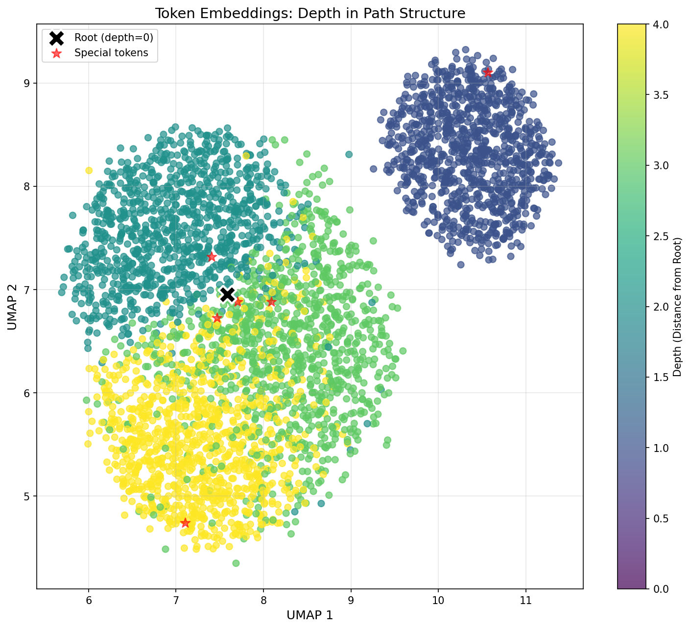
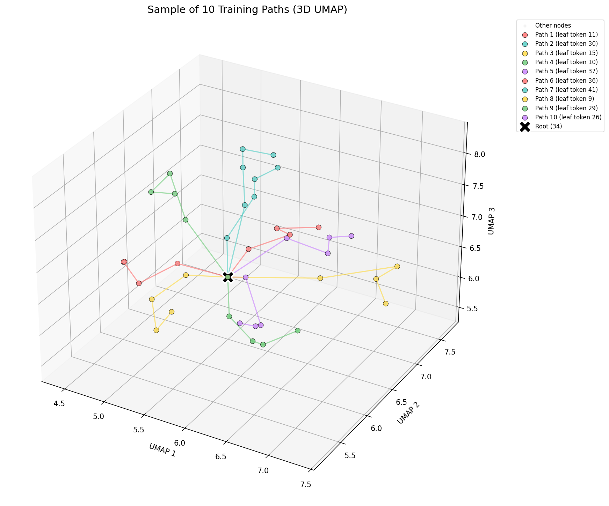
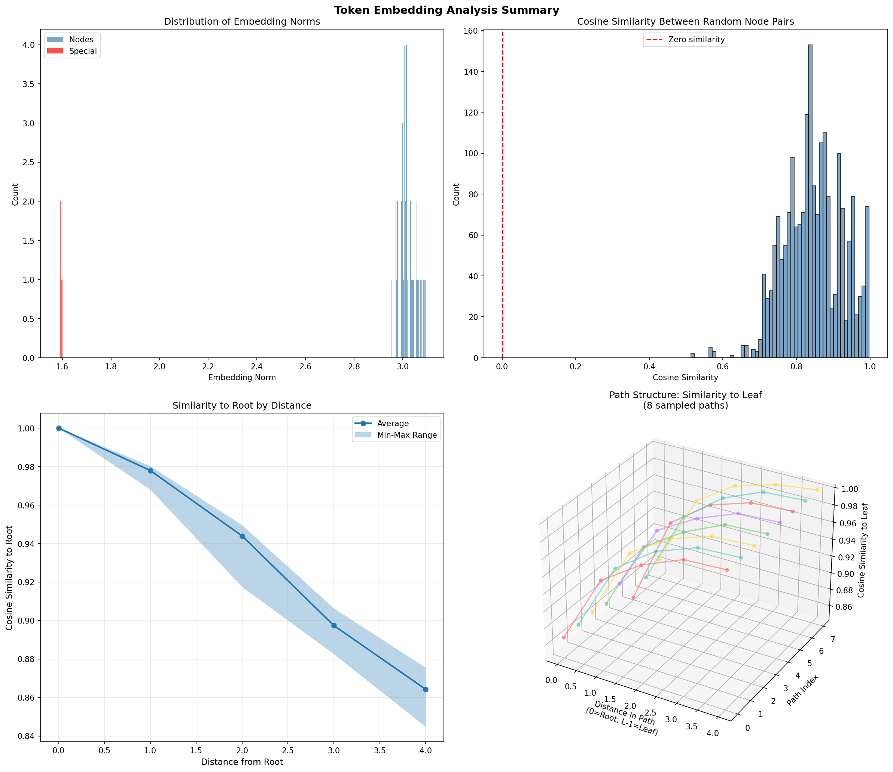

# PathStar Geometric Learning

**Understanding How Transformers Learn Structure in High-Dimensional Space**

A research implementation exploring how decoder-only transformer models learn and represent connected concepts in high-dimensional embedding space, with a focus on geometric vs. associative memorization patterns.

---

## Demo Overview

This demonstration explores research from two foundational papers on how neural networks learn and represent structure:

### Primary Research
**["Deep sequence models tend to memorize geometrically; it is unclear why"](https://www.alphaxiv.org/abs/2510.26745)**
*Noroozizadeh et al., 2024*

**["Toy Models of Superposition"](https://transformer-circuits.pub/2022/toy_model/index.html)**
*Elhage et al., Anthropic, 2022*

### Key Concepts Demonstrated

#### 1. Associative Learning in High-Dimensional Space
When models learn **associatively**, token embeddings remain nearly orthogonal to each other. No global structure emerges—each relationship is viewed through a local lens:
- *Example:* "Sam is Anna's friend, Anna is Julie's friend..."
- Each connection is memorized independently
- Embeddings are high-dimensional and scattered

#### 2. Geometric Learning with Global Structure
When models learn **geometrically**, embeddings are no longer orthogonal but become a low-rank factorization of the graph structure:
- *Example:* "Sam, Anna, and Julie are in the same friend clique"
- Global patterns emerge in the embedding space
- Embeddings align with eigenvectors of the co-occurrence matrix
- Captures hierarchical and structural relationships

#### 3. Live Demo: Training Dynamics & Phase Transitions
Watch how **poor training conditions** cause a transformer to transition through distinct learning regimes:

**Local Structure → Global Structure (sweet spot) → Local Structure**

As training progresses, the model exhibits fascinating phase transitions in its embedding geometry, revealing the delicate balance between memorization strategies.

---

## Visualizations

### 2D UMAP: Depth-Structured Embeddings


This visualization shows learned token embeddings colored by their distance from the root node. Notice how:
- Tokens at similar depths cluster together
- The root (depth=0) occupies a distinct region
- Clear geometric structure emerges, reflecting the graph topology

### 3D UMAP: Path Structure in Embedding Space


A 3D projection of 10 training paths radiating from the central root node. The star-like geometry of the original graph is recovered in the learned embedding space, demonstrating true geometric learning.

### Training Summary: Similarity by Depth


Tracks how cosine similarity to the root decreases as distance from root increases—a hallmark of geometric memorization where the model learns a coherent spatial representation.

---

## Project Architecture

The core objective is to train decoder-only transformers on **PathStar graphs**—star-like structures where "spokes" (paths) radiate from a central root. The model learns structural properties through path completion and edge memorization tasks.

## Key Components

### Core Implementation

**`pathstar.py`** - PathStar Graph Dataset Generator
- Generates graph structures with `d` spokes of length `l`
- Creates adjacency lists and path traversals
- Produces training data for two tasks:
  - **Edge Memorization**: Learning `(u, v)` node pairs
  - **Path Prediction**: Predicting sequential node traversals (leaf-to-root)
- Supports special tokens (PAD, PAUSE, DIRECTIONAL)

**`model.py`** - GPT Transformer Implementation
- Full PyTorch decoder-only transformer architecture
- Includes `CausalSelfAttention` with optional Flash Attention
- Highly configurable via `GPTConfig` dataclass

**`train.py`** - Training Pipeline
- Dataset loading and on-the-fly generation
- Training loop with Weights & Biases (WandB) integration
- Teacher forcing and autoregressive evaluation modes
- Automatic memory optimization and batch size calculation

### Automation & Sweeps

**`run_multi_gpu_sweep.sh`** - Multi-GPU Hyperparameter Sweeps
- Orchestrates WandB sweeps across multiple GPUs
- Intelligent distribution of grid search runs
- Process management and automatic cleanup

### Reference Materials

**`pathstar_paper.pdf`** - The foundational research paper for this implementation

## Usage

### Quick Start

**Train with default configuration:**
```bash
python train.py
```

**Train with custom config file:**
```bash
python train.py --config my_experiment.yaml
```

### Hyperparameter Sweeps

**Run multi-GPU sweep:**
```bash
./run_multi_gpu_sweep.sh sweep_config.yaml [project_name]
```

This will automatically distribute sweep runs across available GPUs and aggregate results in WandB.

---

## What to Expect

When training on PathStar graphs, you'll observe:

1. **Initial Phase**: Random embeddings with no structure
2. **Geometric Phase**: Emergence of low-dimensional structure aligned with graph topology
3. **Potential Collapse**: Under poor training conditions, reversion to high-dimensional memorization

The transition between these phases reveals fundamental insights about how transformers balance between geometric understanding and rote memorization.

---

## Citation

If you use this code or build upon this research, please cite:

```bibtex
@article{noroozizadeh2024deep,
  title={Deep sequence models tend to memorize geometrically; it is unclear why},
  author={Noroozizadeh, Sina and others},
  year={2024},
  url={https://www.alphaxiv.org/abs/2510.26745}
}

@article{elhage2022toy,
  title={Toy Models of Superposition},
  author={Elhage, Nelson and others},
  year={2022},
  journal={Anthropic},
  url={https://transformer-circuits.pub/2022/toy_model/index.html}
}
```

---

## License

See `LICENSE` file for details.
